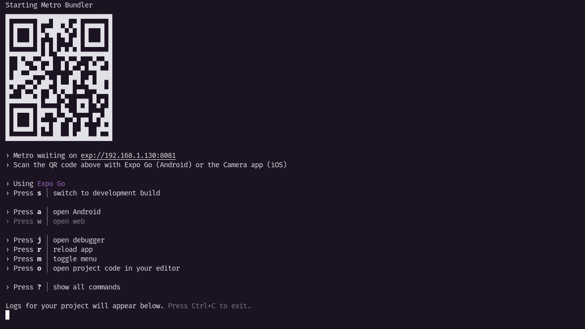

<h1 align="center">
  
</h1>

<p align="center">
  
  
  
  
  
  
</p>

<p align="center">
  <a href="https://github.com/brunodsazevedo/marketspace/blob/master/README-PORTUGUESE-BR.md">
    [README PORTUGUESE-BR VERSION]
  </a>
</p>

## 💻 Project

Marketspace is a mobile application for buying and selling new and used items.

## 🚀 Technologies

This project was developed with the following technologies:

- [x] Expo
- [x] React Native
- [x] TypeScript
- [x] Axios
- [x] NativeWind
- [x] React Native Async Storage
- [x] React Query
- [x] Expo Router
- [x] React Native Gesture Handler
- [x] React Native Reanimated
- [x] Yup

## 📋 Prerequisites

- [x] NodeJS >= 20.0
- [x] yarn
- [x] Android Studio (Optional)
- [x] Xcode (macOS only - optional)

## ⚙️ Running the Project

1. **Install the project dependencies using `yarn`**
    ```bash
    yarn
    ```

2. **Configure the local API**

   NOTE: The application consumes a REST API for operations such as sign in, sign up, product registration, product listing, etc. At the moment, the backend API is not hosted. To use the application locally, download and use [this repository](https://github.com/brunodsazevedo/marketspace-api).

3. **Adjust the axios base URL**

   Before running and opening the application, if you are running the API locally, you will need to adjust the axios base URL according to your IP.

   **On Linux systems:**
    ```bash
    ip a
    ```
   Look for the network interface you are using (usually `eth0` for wired connections and `wlan0` or `wlp2s0` for wireless connections). The IP address will be listed under **inet**.

   **On Windows systems:**
    ```bash
    ipconfig
    ```
   Look for the active network connection (`Ethernet adapter` for wired connections or `Wireless LAN adapter` for wireless connections). The IP address will be listed as "IPv4 Address".

   **On macOS systems:**
    ```bash
    ifconfig
    ```
   Look for the network interface you are using (`en0` for wired connections and `en1` or `en0` for wireless connections). The IP address will be listed under **inet**.

4. **Update the axios configuration**

   Open the file `src/services/api/api-config.ts` and update the base URL on line 19 with your IP acquired from the commands suggested above:
    ```typescript
    const api = axios.create({
      // Insert your IP here
      baseURL: 'http://192.168.1.130:3333',
    }) as ApiInstanceProps
    ```

5. **Run the application**
    ```bash
    npx expo start
    ```

   If everything is configured correctly, you will see a screen like this in your terminal:
   

6. **Opening the application**

   - **Physical Device:** If you have the Expo Go app on your device (Android or iPhone), scan the QR Code to open the app.
   - **Emulator:** To open in the emulator, press the corresponding key for the emulator you want to open ("a" for Android, and "i" for iOS).

---
